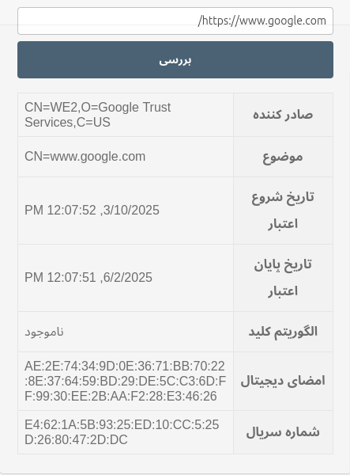

# Certificate Checker

This project is a browser extension for extracting and displaying X.509 certificate information from HTTPS websites. It is developed as part of the Security and Privacy course. The goal of this extension is to make it easier for ordinary users to understand the security certificate details of websites they visit.

## Features
- Extracts X.509 certificate details including issuer, subject, validity period, key algorithm, signature, and serial number.
- Displays extracted information in a clean and organized table.
- Provides user-friendly error handling for invalid or non-HTTPS URLs.
- Fully compatible with Firefox and Chromium-based browsers.

## Project Structure
```
cert-checker/
├── manifest.json        # Extension configuration
├── background.js       # Background script for handling certificate extraction
├── popup/
│   ├── popup.html      # HTML file for the extension's popup UI
│   ├── popup.js          # Script for handling UI interactions
│   └── popup.css        # Styling for the popup and notifications
└── icons/
    └── icon.png            # Extension icons

```

## Installation and Usage
1. Clone the repository:
   ```bash
   git clone https://github.com/Narges-Mntzr/Cert-Checker
   cd Cert-Checker
   ```
2. Load the extension in your browser:
   - **Firefox**: Go to `about:debugging`, click on "This Firefox", and then "Load Temporary Add-on" to select `manifest.json`.
   (The extension icon will appear in the browser toolbar.)
3. Click on the extension icon in the browser toolbar.
4. Enter a website URL (must start with `https://`).
5. Click the "Check" button.
6. The certificate details will be displayed in a structured table.

## Outputs
Here is an example output of the plugin for google.com:

<p align="center">
  
</p>

## Contact
For any inquiries or support, feel free to contact the developer at [Narges.montazeri81@gmail.com].

